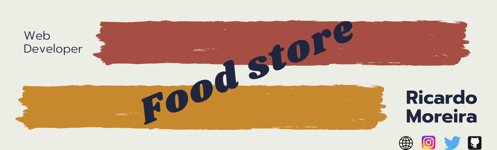
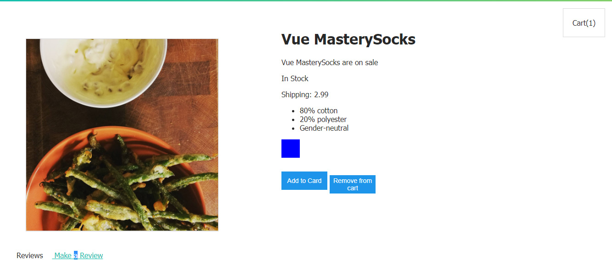
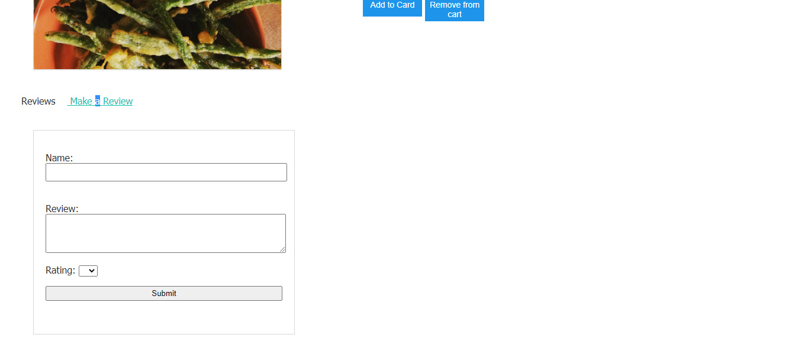

<h1 align="center"> 🔥Food Store🔥</h1>

<h2 align="center"> A shopping cart made with Vue</h2>

### Index

* [Name](#Name) 👈
* [Links](#Links) 🔗
* [Description](#Description) 📖
* [Languages and Frameworks](####Languages-and-Frameworks) ⚙️
* [Screenshots](#Screenshots) 📱
* [Instalation](#Instalation) 🧩
* [Support](#Support) 🆘
* [Roadmap](#Roadmap) 🗺️
* [Authors and acknowledgment](####Authors-and-acknowledgment) ✍️
* [Project Status](#Project-Status) 📜

# Name

Food Store

# Links

[Website](https://tender-borg-e6db6e.netlify.app/)

___

# Description

I took some classes from [Vue Mastery](https://www.vuemastery.com/) and this was my approach to create a small food store where you can add and remote products from the card

___

# Languages, Frameworks and others

* **Vuejs** - Framework

____

# Screenshots

Home Page         |  Review Page
:-------------------------:|:-------------------------:
  |  

____

# Instalation

___

# Support

Have any question or find something that doesn't look good? Let's talk 😊

[Here](https://github.com/mugas)

[And Here](https://www.ricardomoreira.io/about)

____

# Roadmap

____

# Authors-and-acknowledgment

* [Based on this](https://www.vuemastery.com/)

* Me 😊

____

# Project-Status  

Done

____
